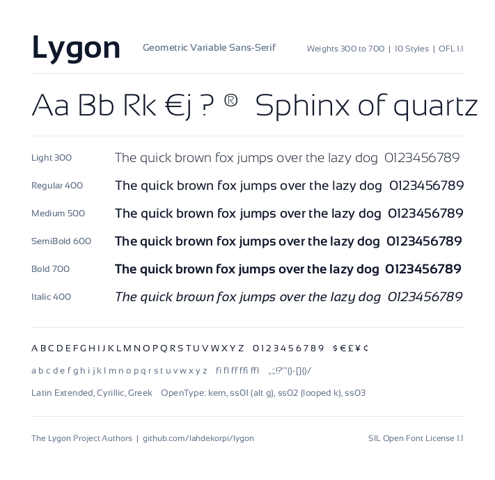

# Lygon

Lygon is a modern geometric variable sans-serif font family derived from Sansation (originally designed by Bernd Montag in 2011).

This project modernizes the typeface for contemporary digital design, web typography, and print. It resolves geometric quirks, establishes proportional cutout consistency, re-engineers letterforms, eliminates forced fused ligatures, and compiles full variable font weights (300 to 700) for both upright and italic styles.



---

## Key Refinements

### 1. Normalized Cutout Proportions (B, K, P, R)
In original Sansation, internal cutout spaces between stems and junctions ranged from 180 to 230 font units, creating wide, gaping voids. Lygon halves these cutout gaps to ~90 to 115 font units, harmonizing them with the natural proportion anchor of letter A (~95 to 110 units). Outer bowl curves are strictly preserved.

### 2. Uniform Leg and Arm Thickness (K, R)
Both the inner apex and the outer bowl/stem junction points were translated simultaneously by the exact same distance. This ensures the diagonal legs maintain constant, uniform stroke thickness (182 units in Regular, 244 units in Bold) without wedge-shaped distortion.

### 3. Redesigned Lowercase k
Replaced the disconnected looped arch with a contemporary straight-arm construction directly matching capital K, spanning from x-height (1050 units) to baseline (0 units) with a ~90-unit cutout. The original looped arch is preserved under OpenType Stylistic Set 2 (`ss02`).

### 4. Extended Lowercase j Descender
Extended Sansation's authentic round curve into a complete, balanced descender by shifting the bottom apex and terminal tip leftward by 80 font units.

### 5. Redesigned Euro Currency Symbol (€)
In original Sansation, the two crossbars terminated abruptly inside the inner counter, causing visual confusion with mathematical set membership symbols (like element-of). Lygon cuts both crossbars cleanly through the back spine curve to the left across all weights and styles.

### 6. Toned Down Question Mark (?)
Toned down the distended, ballooning rightward overhang of the question mark by ~80 units, producing a cohesive curve that integrates naturally into text lines.

### 7. Synchronized Registered Trademark Symbol (®)
The inner R of the registered trademark symbol now shares the exact geometry of Lygon's refined capital R, featuring the harmonized cutout gap and uniform diagonal leg.

### 8. Clean Text Setting (No Forced Fused Ligatures)
Removed forced fused f-ligatures (`fi`, `fl`, `ff`, `ffi`, `ffl`, `fj`, `ffj`) from OpenType standard ligatures (`liga`). Everyday typing in words like "Refined" or "defined" renders clean, independent glyphs with authentic hooks and full dot visibility.

---

## Repository Structure

```text
lygon/
├── AUTHORS.txt                 # Author and project owner
├── CONTRIBUTORS.txt            # Upstream and historical contributors
├── FONTLOG.txt                 # Detailed changelog and font history
├── OFL.txt                     # SIL Open Font License 1.1
├── README.md                   # Project documentation
├── documentation/
│   ├── specimen.html           # Interactive web specimen with comparison cards
│   ├── lygon-specimen.png      # Specimen showcase sheet
│   └── glyph_inspection.html   # Diagnostic character grid and text tester
├── fonts/
│   ├── variable/               # Upright and Italic variable fonts (wght 300-700)
│   ├── ttf/                    # 10 static TrueType font files
│   ├── woff/                   # 10 static + 2 variable WOFF files
│   └── woff2/                  # 10 static + 2 variable WOFF2 files
├── requirements.txt            # Python build dependencies
└── sources/
    ├── build.py                # Python build pipeline using fontTools
    └── Sansation-*.ttf         # Upstream source master fonts
```

---

## Font Family Structure

### Variable Fonts
Located in `fonts/variable/` (with web font versions in `fonts/woff/` and `fonts/woff2/`):
- `Lygon[wght].ttf`: Upright variable font with continuous weight axis from 300 (Light) to 700 (Bold).
- `Lygon-Italic[wght].ttf`: Italic variable font (-11.31 degree angle) with continuous weight axis from 300 to 700.

### 10 Static Instances
Supplied in TrueType (`fonts/ttf/`), WOFF (`fonts/woff/`), and WOFF2 (`fonts/woff2/`):
- **Light** (Weight 300) / **Light Italic**
- **Regular** (Weight 400) / **Italic**
- **Medium** (Weight 500) / **Medium Italic**
- **SemiBold** (Weight 600) / **SemiBold Italic**
- **Bold** (Weight 700) / **Bold Italic**

---

## OpenType Features

| Feature Tag | Description |
| :--- | :--- |
| `kern` | Comprehensive GPOS pair kerning |
| `ss01` | Alternate double-storey lowercase g |
| `ss02` | Alternate looped lowercase k (original Sansation style) |
| `ss03` | Capital German Eszett (ẞ) |
| `onum` | Oldstyle figures |
| `lnum` | Lining figures |
| `frac` | Diagonal fraction formatting |
| `case` | Case-sensitive punctuation alignment |

---

## Building from Source

To compile the entire family from source:

### Prerequisites
- Python 3.10+
- Dependencies listed in `requirements.txt`

```bash
pip install -r requirements.txt
```

### Build Command
Run the build script from the repository root:

```bash
python3 sources/build.py
```

The script compiles:
1. 6 modified master fonts with modernized metadata and OpenType tables.
2. Master topology harmonizations for variable font interpolation.
3. Upright and Italic variable fonts via `varLib`.
4. 10 static instances across TTF, WOFF, and WOFF2 formats directly into `fonts/`.

---

## Interactive Specimens

The `documentation/` directory provides interactive tools for testing and inspection:
- `documentation/specimen.html`: Interactive web specimen featuring dynamic weight sliders, posture toggles, OpenType feature switches, and 10 side-by-side comparison cards (A, B, K, P, R, k, j, €, ?, ®).
- `documentation/glyph_inspection.html`: Comprehensive diagnostic overview covering uppercase, lowercase, numerals, currency, symbols, and multi-weight text samples.

---

## License & Attribution

Lygon is licensed under the [SIL Open Font License, Version 1.1](OFL.txt).

- **Original Font**: Sansation, Copyright 2011 Bernd Montag (with Reserved Font Name "Sansation").
- **Modernization & Refinements**: Copyright 2026 The Lygon Project Authors.
